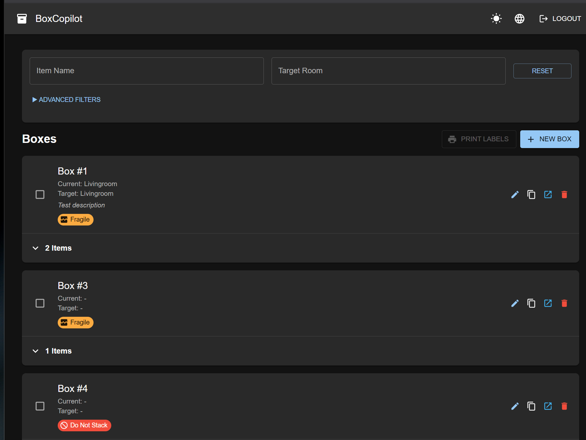
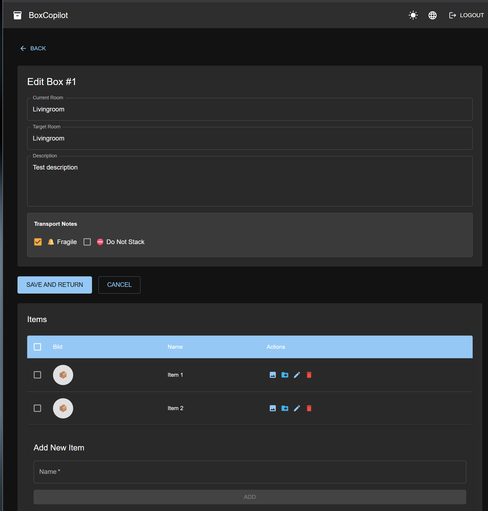
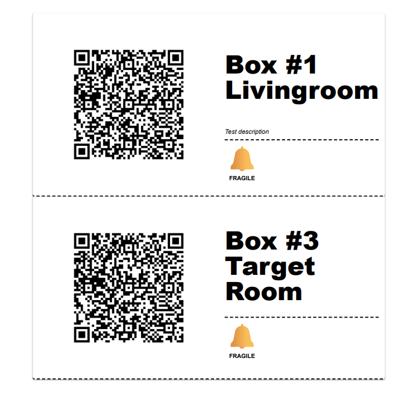

# BoxCopilot

[](https://www.gnu.org/licenses/gpl-3.0)

**Keep your moving organized.** BoxCopilot helps families stay sane during moves by tracking what's packed in each box and where it should go. No more opening 20 boxes to find your coffee maker.


*Main dashboard showing all boxes with search and room filtering*


*Manage box contents and assign rooms*


*Share box contents with family members via QR code - no login required*


*Print labels with QR codes for easy scanning*

## Core Features

### Box & Item Management
- 📦 **Box Management** - Track boxes with current location and target room assignments
- 📝 **Item Inventory** - Maintain detailed lists of contents for each box
- 🔍 **Global Search** - Quickly find which box contains specific items
- 🔗 **Public QR Sharing** - Share box contents with movers/family via scannable QR codes (no authentication required)
- 🖨️ **Bulk Label Printing** - Print multiple box labels with QR codes at once
- 📷 **Item Images** - Upload via camera or file, view thumbnails and large previews, publicly shareable
- 🔀 **Move Items** - Move single or multiple items between boxes with a guided dialog

### Authentication & User Management
- 🔐 **Dual Authentication** - Login via Nextcloud (OIDC) or local credentials
- 👥 **User Management** - Admin panel for creating, editing, and managing users
- 🔑 **Magic Login Links** - Passwordless authentication via time-limited, single-use tokens
- 🛡️ **Role-Based Access Control** - USER and ADMIN roles with different permissions
- 🔒 **Account Security** - Automatic lockout after 5 failed login attempts (1 hour)
- ⚡ **Auto-User Creation** - OIDC users are automatically registered on first login

### User Experience
- 🌙 **Dark Mode** - Toggle between light/dark themes with cookie persistence
- 🌐 **Multi‑Language** - Switch between languages (DE/EN) with persistent preference

### Feature Highlights

**Item Image Management**
- **Upload**: Capture via camera or upload from file (requires login)
- **Public Access**: Images are accessible via secure token-based URLs (no login required)
- **Two Sizes**: Automatic thumbnail (200x200px) and large image (1024px) generation
- **Preview**: View large images in full-screen dialog with automatic fallback to thumbnail
- **Delete**: Remove images when no longer needed (requires login)
- **Cache-Busting**: Automatic timestamp-based cache invalidation for instant updates

**User Management & Authentication**
- **Admin Panel**: Create and manage users (ADMIN role required)
  - Create users with username, email, name, and optional password
  - Assign USER or ADMIN roles
  - Enable/disable accounts
  - Generate magic login links for passwordless access
- **Magic Login Links**: 
  - Generate secure, time-limited (24 hours default) single-use login tokens
  - Perfect for temporary access or users without passwords
  - Old tokens are automatically invalidated when generating new ones
  - Accessible via `/api/v1/auth/magic-login?token={uuid}`
- **Dual Authentication**:
  - **Nextcloud/OIDC**: Automatic user creation on first login with username conflict resolution
  - **Local Login**: Traditional username/password authentication
  - **Form Login**: Available at `/login` with redirect after authentication
- **Security Features**:
  - Account lockout after 5 failed login attempts for 1 hour
  - Failed attempt tracking with automatic reset on successful login
  - Password encryption using BCrypt
  - Session management via JDBC (dev) or Redis (prod)

**Language & Localization**
- Top‑bar language menu lets you switch between German and English
- Choice is remembered (cookie‑based) and applied across the app

**Move Items Between Boxes**
- Select one or more items in the box details table and choose "Verschieben" (Move)
- Pick target box by UUID and confirm; bulk operations are supported

## Development

### Prerequisites
- Java 21
- Node.js 20+
- Maven 3.9+

### Backend

**Required Environment Variables:**
```powershell
# PowerShell
$env:FRONTEND_URL = 'http://localhost:3000'
$env:CLIENT_ID = 'your-nextcloud-client-id'
$env:CLIENT_SECRET = 'your-nextcloud-client-secret'
$env:NEXTCLOUD_URL = 'https://cloud.example.com'
$env:NEXTCLOUD_LOGOUT_URL = 'https://cloud.example.com/index.php/logout'
$env:SPRING_PROFILES_ACTIVE = 'dev'
```

**Run Backend (Maven ONLY - never execute JAR directly):**
```bash
cd backend
mvn spring-boot:run
```
Runs on port 8080 with H2 file-based database at `./data/boxcopilot-dev`.

**Default Admin User:**  
On first startup, a default admin account is created:
- Username: `admin`
- Password: `admin`
- Role: `ADMIN`

**Important:** Change the default password immediately after first login.

### Frontend
```bash
cd frontend
npm install
npm run dev
```
Runs on port 5173 with Vite dev server. API calls are proxied to `http://localhost:8080`.

### Configuration Profiles
- `dev` - H2 file database, JDBC sessions, OIDC enabled, dual authentication
- `prod` - PostgreSQL, Redis sessions, OIDC enabled, dual authentication
- `test` - H2 in-memory, security disabled for testing

See [application-*.yml](backend/src/main/resources/) for profile configurations.

### API Endpoints

**Authentication:**
- `POST /login` - Form-based login (username + password)
- `GET /oauth2/authorization/nextcloud` - Initiate OIDC login
- `GET /api/v1/auth/magic-login?token={uuid}` - Magic link authentication
- `POST /api/v1/auth/logout` - Logout current user
- `GET /api/v1/me` - Get current user info

**User Management (ADMIN only):**
- `GET /api/v1/admin/users` - List all users
- `POST /api/v1/admin/users` - Create new user
- `PUT /api/v1/admin/users/{id}` - Update user
- `DELETE /api/v1/admin/users/{id}` - Delete user
- `POST /api/v1/admin/users/{id}/magic-link` - Generate magic login link

**Boxes (authenticated):**
- `GET /api/v1/boxes` - List all boxes
- `POST /api/v1/boxes` - Create box
- `PUT /api/v1/boxes/{id}` - Update box
- `DELETE /api/v1/boxes/{id}` - Delete box

**Items (authenticated):**
- `GET /api/v1/items` - List all items
- `POST /api/v1/items` - Create item
- `PUT /api/v1/items/{id}` - Update item
- `DELETE /api/v1/items/{id}` - Delete item
- `POST /api/v1/items/{id}/image` - Upload item image
- `DELETE /api/v1/items/{id}/image` - Delete item image

**Public Access (no authentication):**
- `GET /api/v1/public/{uuid}` - Get box preview by UUID
- `GET /api/v1/public/items/{token}/image` - Get item thumbnail
- `GET /api/v1/public/items/{token}/image/large` - Get large item image

## Production Deployment

### Prerequisites
- Docker & Docker Compose
- Traefik reverse proxy (must be running externally)
- Nextcloud instance for OIDC authentication

### Setup

1. **Configure environment variables**

Create `.env` file:
```bash
# Database
POSTGRES_USER=boxuser
POSTGRES_PASSWORD=secure-password-here
POSTGRES_DB=boxcopilot

# OAuth2/OIDC (Nextcloud)
CLIENT_ID=your-nextcloud-oauth-client-id
CLIENT_SECRET=your-nextcloud-oauth-client-secret
NEXTCLOUD_URL=https://cloud.example.com
NEXTCLOUD_LOGOUT_URL=https://cloud.example.com/index.php/logout

# Traefik Hosts
TRAEFIK_FRONTEND_HOST=boxes.example.com
TRAEFIK_BACKEND_HOST=boxes-api.example.com
```

2. **Start services**
```bash
docker-compose up -d
```

### Nextcloud OIDC Setup

Register OAuth2/OIDC client in Nextcloud:
- **Redirect URI**: `https://boxes-api.example.com/login/oauth2/code/nextcloud`
- **Grant Type**: Authorization Code
- **Scopes**: `openid`, `profile`, `email`

Use the generated `client_id` and `client_secret` in your `.env` file.

### Reverse Proxy (Traefik)

**Important:** BoxCopilot requires Traefik to be running **externally** before starting the application. The services connect to an existing Traefik instance via the `traefik-proxy` Docker network.

#### Complete Traefik Setup Example

If you don't have Traefik running yet, create a separate `traefik-compose.yml`:

```yaml
version: '3.8'

services:
  traefik:
    image: traefik:v2.10
    container_name: traefik
    restart: unless-stopped
    security_opt:
      - no-new-privileges:true
    networks:
      - traefik-proxy
    ports:
      - "80:80"
      - "443:443"
    environment:
      - CLOUDFLARE_EMAIL=${CLOUDFLARE_EMAIL}     # Optional: for DNS challenge
      - CLOUDFLARE_API_KEY=${CLOUDFLARE_API_KEY}   # Optional: for DNS challenge
    volumes:
      - /etc/localtime:/etc/localtime:ro
      - /var/run/docker.sock:/var/run/docker.sock:ro
      - ./traefik/traefik.yml:/traefik.yml:ro
      - ./traefik/acme.json:/acme.json
      - ./traefik/config.yml:/config.yml:ro
    labels:
      - "traefik.enable=true"
      - "traefik.http.routers.traefik.entrypoints=http"
      - "traefik.http.routers.traefik.rule=Host(`traefik.example.com`)"
      - "traefik.http.middlewares.traefik-https-redirect.redirectscheme.scheme=https"
      - "traefik.http.middlewares.sslheader.headers.customrequestheaders.X-Forwarded-Proto=https"
      - "traefik.http.routers.traefik.middlewares=traefik-https-redirect"
      - "traefik.http.routers.traefik-secure.entrypoints=https"
      - "traefik.http.routers.traefik-secure.rule=Host(`traefik.example.com`)"
      - "traefik.http.routers.traefik-secure.tls=true"
      - "traefik.http.routers.traefik-secure.tls.certresolver=cloudflare"
      - "traefik.http.routers.traefik-secure.service=api@internal"

networks:
  traefik-proxy:
    external: false
```

Create `traefik/traefik.yml`:
```yaml
api:
  dashboard: true
  debug: true

entryPoints:
  http:
    address: ":80"
    http:
      redirections:
        entryPoint:
          to: https
          scheme: https
  https:
    address: ":443"

serversTransport:
  insecureSkipVerify: true

providers:
  docker:
    endpoint: "unix:///var/run/docker.sock"
    exposedByDefault: false
  file:
    filename: /config.yml

certificatesResolvers:
  cloudflare:
    acme:
      email: your-email@example.com
      storage: acme.json
      # Use HTTP challenge for Let's Encrypt:
      # httpChallenge:
      #   entryPoint: http
      # Or DNS challenge (example with Cloudflare):
      dnsChallenge:
        provider: cloudflare
        resolvers:
          - "1.1.1.1:53"
          - "1.0.0.1:53"
```

Create empty `traefik/acme.json` with correct permissions:
```bash
mkdir -p traefik
touch traefik/acme.json
chmod 600 traefik/acme.json
```

Start Traefik:
```bash
docker-compose -f traefik-compose.yml up -d
```

Verify the `traefik-proxy` network exists:
```bash
docker network ls | grep traefik-proxy
```

Then start BoxCopilot services with the main `docker-compose.yml`.

#### Network Configuration

BoxCopilot's `docker-compose.yml` connects to the external `traefik-proxy` network:
```yaml
networks:
  traefik-proxy:
    external: true
```

Both frontend and backend services include Traefik labels for:
- HTTP → HTTPS redirect
- TLS certificate provisioning (Let's Encrypt)
- Host-based routing

## Technology Stack

**Backend:** Java 21, Spring Boot 3.5, Spring Security with OAuth2/OIDC, Spring Data JPA, PostgreSQL, Redis, Flyway

**Frontend:** React 18, TypeScript, Vite, Material-UI, Axios, React Router

**Infrastructure:** Docker, Docker Compose, Traefik, PostgreSQL 15, Redis

## License

This project is licensed under the **GNU General Public License v3.0 (GPL-3.0)**.

**You are free to:**
- ✅ **Use** - Run the program for any purpose
- ✅ **Study** - Access and study the source code
- ✅ **Share** - Copy and distribute the software
- ✅ **Modify** - Make changes and improvements to the software

**Under the following terms:**
- 📝 **Copyleft** - If you distribute modified versions, you must also license them under GPL v3.0
- 🔓 **Source Code** - You must make the source code available when you distribute the software
- 📄 **License Notice** - You must include a copy of the GPL v3.0 license and copyright notice
- 🔄 **Same License** - All derivative works must be licensed under the same GPL v3.0 terms

This ensures that BoxCopilot and all its derivatives remain free and open source software forever.

See [LICENSE](LICENSE) for full details or visit https://www.gnu.org/licenses/gpl-3.0.html
